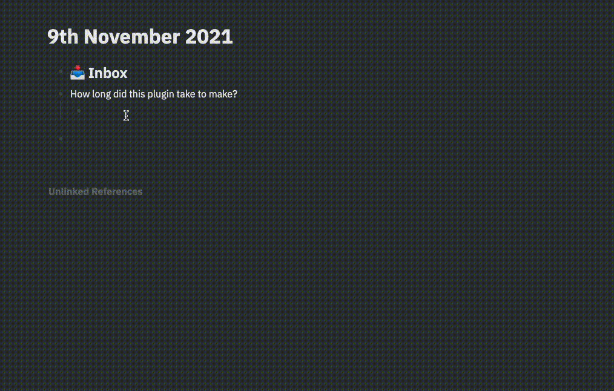

# Imgur Upload for Logseq

Adds `/imgur` command to Logseq which opens up a form to upload and insert the image from Imgur. This allows for easy sharing of files without having to upload the images elsewhere. Also good for saving space on your local storage.

## Installation

This plugin is available for Logseq from the marketplace.

## Development

1. Clone the repo
2. Run `npm install && npm run dev` to install dependencies and start dev enviroment.
3. Select the repo directory via `Load unpacked plugin` in Logseq Desktop client.
